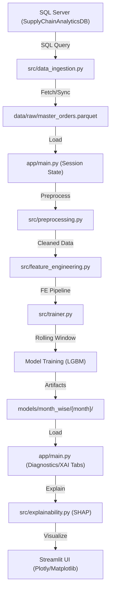

# OTIF Prediction - System Architecture

This document outlines the end-to-end data flow and execution sequence of the OTIF Rolling Window AI Manager.

## Execution Sequence

## Component Roles

### 1. `src/data_ingestion.py`
- **Role**: Entry point for data.
- **Functions**:
    - `fetch_data`: Retrieves records from SQL using a date-filtered template.
    - `get_local_master_data`: Loads the persistent `.parquet` repository.
    - `append_to_master_data`: Merges new SQL data with local data to avoid duplicates.

### 2. `src/preprocessing.py`
- **Role**: Basic data cleaning.
- **Operations**:
    - Handles nulls for date/cat columns.
    - Standardizes column types.
    - Filters out invalid/out-of-scope records.

### 3. `src/feature_engineering.py`
- **Role**: Core business logic.
- **Sequence**:
    - `add_safe_features`: Base transforms (deltas, gaps).
    - `apply_miss_rate_maps`: Static risk maps based on historical performance.
    - `add_order_complexity_features`: Aggregates like line count and total value.
    - `add_tolerance_risk_features`: Logic for how tight delivery windows impact risk.
    - `add_interaction_stack_features`: Combining multiple risk signals (e.g., tight window + high congestion).

### 4. `src/trainer.py`
- **Role**: Rolling window orchestration.
- **Logic**:
    - Iterates through the requested `start_month` to `end_month`.
    - Implements **Stateful Initial Context**: Automatically loads preceding month's threshold/results for adaptive tuning.
    - Trains `LGBMClassifier` with weighted classes.
    - Saves models, reports, and per-month predictions.

### 5. `src/evaluator.py`
- **Role**: Model performance and threshold tuning.
- **Logic**:
    - `find_best_threshold`: Optimizes for F-beta score while respecting precision floors.
    - `adaptive_threshold_from_calib`: Implements smoothing and guardrails on threshold changes month-over-month.

### 6. `src/explainability.py`
- **Role**: Model transparency.
- **Tools**:
    - `SHAP`: Global and local feature impact analysis.
    - Generates Beeswarm, Importance Bar charts, and Force plots.
- **Output**: Reports are saved within each month's versioned folder (`models/month_wise/{month}/reports/`) for traceability.

---
