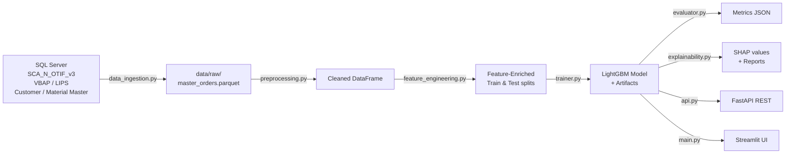

# Backend `otif-model` — Complete Pipeline Walkthrough

> [!NOTE]
> This document covers **every step** in the backend ML pipeline: data sourcing, column selection, column drops, preprocessing, feature engineering, training, evaluation, explainability, and the API/Streamlit serving layer.

---

## 1. Architecture Overview

---

## 2. Data Ingestion ([data_ingestion.py](file:///c:/Users/Sadaf%20Ambreen/Desktop/otif/backend/otif-model/src/data_ingestion.py))

### 2.1 SQL Source

The SQL query (`SQL_QUERY_TEMPLATE`) pulls from **four joined CTEs** targeting a SQL Server database defined in [config.yaml](file:///c:/Users/Sadaf%20Ambreen/Desktop/otif/backend/otif-model/config/config.yaml) (`SDVWEDWSHSS01` / `SupplyChainAnalyticsDB`):

#### CTE 1 — `OTIF_Base_Data` (primary orders)
- **Source table**: `SupplyChainAnalyticsDB.dbo.SCA_N_OTIF_v3`
- **Filters applied**:
  - `Reporting_Date >= '2023-09-01'` AND `< '2026-02-01'`
  - `Customer group <> '99'`
  - `Item category <> 'ZFTG'`
  - `Order reason NOT IN ('Z70', 'Y42')`
  - `Customer_Pickup = 'No'`
  - `OTIF_Type = 'Internal Plant OTIF'`
  - Plant must exist in `SCA_Plant_Master` with `Plant Region = 'NAM'`

| Column pulled | Renamed as |
|---|---|
| `Sales order` | — |
| `SO Line` | — |
| `SO create date` | — |
| `Mat_Avl_Date_OTIF` | — |
| `Material`, `Material description`, `ABC Indicator`, `Plant`, `Ship_To`, `Sold-to party` | — |
| `Net value_y` | `Net_Value(Header Level od Document)` |
| `Net value_x` | `Net_Value(Item Level at Document)` |
| `Document Currency` | `Local Currency` |
| `Net weight` | `Ordered_Quantity` |
| `Sales Organization` | — |
| `Reporting_Date` | `Requested Delivery Date` |
| `CSR`, `Customer_Pickup` | — |
| `OTIF_HIT/MISS`, `OTIF_Type` | — |
| `Overdeliv_Tolerance_OTIF`, `Underdel_Tolerance_OTIF` | — |
| `Confirmed Quantity_OTIF` | `First_Confirmed_Quantity` |
| `Time_Factor` | — |
| `Delivery Date_y_OTIF` | `Delivery_Date For Solenis` |
| `Act_Gd_Mvmnt_Date_OTIF` | `Delivery_Date For Sigura and Diversey (Actual Goods Movement)` |
| `TASKI_Indicator` | `TASKI Machine Indicator` |
| `Delivery Number`, `Delivery Created On` | — |
| `Agg_Qty` | `Orderd_Qty_y` |

#### CTE 2 — `VBAP` (SAP Sales Item Data)
- **Source**: `LIB_EDW_RTP.bv.[VBAP: Sales Document: Item Data]`
- **Joined** to `SCA_Plant_Master` for `Location Type for Metrics`
- **Columns produced**: `NtWtInKGs` (weight converted to KG), `BaseUOM`, `Base_Quanity`, `NetValue_in_Local_Currency`, `SD_Document_Currency`

#### CTE 3 — `LIPS` (SAP Delivery Item Data)
- **Source**: `LIB_EDW_RTP.bv.[LIPS: SD document: Delivery: Item data]`
- **Columns produced**: `Delivered_NtWtInKGs`, `Delivered_Quantity_in_Base_UOM` (aggregated per SO+SOLine)

#### CTE 4 — Customer dimension
- **Source**: `LIB_EDW_RTP.dim.Customer`
- **Columns produced**: `Customer Name`, `City`, `State - Province`, `Country`

#### CTE 5 — Material dimension
- **Source**: `SupplyChainAnalyticsDB.dbo.SCA_Material_Master`
- **Columns produced**: `Division of Business Name`, `Material_Product_line`, `MATERIAL_TYPE`, `Material Base Code Desc`

### Final SELECT joins all CTEs on `Sales order` + `SO Line` (VBAP/LIPS) and `Ship_To` → Customer, `Material` → Material Master.

### 2.2 Caching & Master Data

| Function | What it does |
|---|---|
| [fetch_data()](file:///c:/Users/Sadaf%20Ambreen/Desktop/otif/backend/otif-model/src/data_ingestion.py#60-81) | Runs SQL or loads from Parquet cache (`data/raw/otif_data_*.parquet`) |
| [save_master_data()](file:///c:/Users/Sadaf%20Ambreen/Desktop/otif/backend/otif-model/src/data_ingestion.py#34-39) | Overwrites `data/raw/master_orders.parquet` |
| [append_to_master_data()](file:///c:/Users/Sadaf%20Ambreen/Desktop/otif/backend/otif-model/src/data_ingestion.py#40-59) | Deduplicates on [(Sales order, SO Line)](file:///c:/Users/Sadaf%20Ambreen/Desktop/otif/backend/otif-model/src/explainability.py#114-124) keeping **last** occurrence, then saves |
| [get_local_master_data()](file:///c:/Users/Sadaf%20Ambreen/Desktop/otif/backend/otif-model/src/data_ingestion.py#24-33) | Reads the master parquet, parses the split date col to datetime |

---

## 3. Preprocessing ([preprocessing.py](file:///c:/Users/Sadaf%20Ambreen/Desktop/otif/backend/otif-model/src/preprocessing.py))

Called via [preprocess_data(df, config)](file:///c:/Users/Sadaf%20Ambreen/Desktop/otif/backend/otif-model/src/preprocessing.py#26-72). Steps in order:

### Step 1 — Parse date columns
Converts these to `datetime64`:
- `SO create date`
- `Mat_Avl_Date_OTIF`
- `Requested Delivery Date`

### Step 2 — Drop leakage / post-hoc columns

> [!CAUTION]
> These columns are **dropped** because they contain information only available *after* the delivery happens, which would leak future info into the model.

| Dropped column | Reason |
|---|---|
| `Delivery_Date For Solenis` | Actual delivery date |
| `Delivery_Date For Sigura and Diversey (Actual Goods Movement)` | Actual delivery date |
| `Delivery Number` | Post-order artifact |
| `Delivery Created On` | Post-order artifact |
| `Delivered_Qty_in_Kgs` | Actual delivered qty |
| `Delivered_Quantity_in_Base_UOM` | Actual delivered qty |
| `OTIF_Type` | Constant after filtering |
| `Time_Factor` | Post-hoc calculation |
| `Orderd_Qty_y` | Redundant aggregated qty |

### Step 3 — Fill categorical NaNs with `"Unknown"`
Columns affected: `Division of Business Name`, `MATERIAL_TYPE`, `Material_Product_line`, `ABC Indicator`, `Base_UOM`, `Material Base Code Desc`, `Ordered_Quantity_Base_UOM`, `Local_Currency_Item`

### Step 4 — Create binary target
- Raw column: `OTIF_HIT/MISS` → mapped `"hit"→1`, `"miss"→0` → stored as `otif_numeric`
- Rows with unmappable target values are **dropped** (`dropna`)

### Step 5 — Create `split_month`
- `Requested Delivery Date` → `pd.Period("M")` → stored as `split_month`
- Rows with missing `Requested Delivery Date` are **dropped**

---

## 4. Feature Engineering ([feature_engineering.py](file:///c:/Users/Sadaf%20Ambreen/Desktop/otif/backend/otif-model/src/feature_engineering.py))

Called via [run_fe_pipeline(train_df, test_df, config)](file:///c:/Users/Sadaf%20Ambreen/Desktop/otif/backend/otif-model/src/feature_engineering.py#245-303). All engineered features are **prefixed with [f_](file:///c:/Users/Sadaf%20Ambreen/Desktop/otif/backend/otif-model/src/explainability.py#107-171)**. The pipeline has **10 stages**:

### Stage 1 — [add_safe_features()](file:///c:/Users/Sadaf%20Ambreen/Desktop/otif/backend/otif-model/src/feature_engineering.py#4-47)
Derives timing and pricing signals from raw columns:

| Feature | Formula / Logic |
|---|---|
| `f_so_to_rdd_days` | `Requested Delivery Date − SO create date` (days) |
| `f_so_to_mat_avail_days_from_dates` | `Mat_Avl_Date_OTIF − SO create date` (days) |
| `f_mat_avail_to_rdd_days` | `Requested Delivery Date − Mat_Avl_Date_OTIF` (days) |
| `f_mat_ready_after_rdd` | 1 if material available **after** RDD (negative gap) |
| `f_request_lead_days` | Alias of `f_so_to_rdd_days` |
| `f_material_lead_days` | Alias of `f_so_to_mat_avail_days_from_dates` |
| `f_lead_gap_days` | `request_lead − material_lead` |
| `f_tight_ratio` | `request_lead / (material_lead + 1)` |
| `f_is_tight_order` | 1 if tight_ratio < 1.0 |
| `f_is_extremely_tight` | 1 if tight_ratio < 0.75 |
| `f_critical_negative_gap` | 1 if gap < −3 days |
| `f_mild_negative_gap` | 1 if −3 ≤ gap < 0 |
| `f_large_positive_gap` | 1 if gap > 7 days |
| `f_unit_price_log` | `log1p(value / qty)` |
| `f_so_woy_sin`, `f_so_woy_cos` | Week-of-year sine/cosine from `SO create date` |
| `f_rdd_woy_sin`, `f_rdd_woy_cos` | Week-of-year sine/cosine from `Requested Delivery Date` |

Temp columns `_qty` and `_val` are **dropped** after computation.

### Stage 2 — [build_and_apply_congestion_features()](file:///c:/Users/Sadaf%20Ambreen/Desktop/otif/backend/otif-model/src/feature_engineering.py#111-127)
Rolling order counts in 7-day and 30-day windows, computed per entity via `merge_asof`:

| Feature | Description |
|---|---|
| `f_plant_orders_7d` / `f_plant_orders_30d` | Rolling order count at Plant |
| `f_material_orders_7d` / `f_material_orders_30d` | Rolling order count for Material |
| `f_shipto_orders_7d` / `f_shipto_orders_30d` | Rolling order count for Ship-To |

### Stage 3 — [build_miss_rate_maps_recent()](file:///c:/Users/Sadaf%20Ambreen/Desktop/otif/backend/otif-model/src/feature_engineering.py#48-85) + [apply_miss_rate_maps()](file:///c:/Users/Sadaf%20Ambreen/Desktop/otif/backend/otif-model/src/feature_engineering.py#86-110)
Smoothed historical miss rates using **last 6 months** of training data (Bayesian smoothing with α=20):

| Feature | Grouped by |
|---|---|
| `f_customer_miss_rate` | `Ship_To` |
| `f_material_miss_rate` | `Material` |
| `f_plant_miss_rate` | `Plant` |
| `f_bu_miss_rate` | `Division of Business Name` |
| `f_mat_shipto_miss_rate` | [(Material, Ship_To)](file:///c:/Users/Sadaf%20Ambreen/Desktop/otif/backend/otif-model/src/explainability.py#114-124) pair |
| `f_plant_material_miss_rate` | [(Plant, Material)](file:///c:/Users/Sadaf%20Ambreen/Desktop/otif/backend/otif-model/src/explainability.py#114-124) pair |
| `f_plant_shipto_miss_rate` | [(Plant, Ship_To)](file:///c:/Users/Sadaf%20Ambreen/Desktop/otif/backend/otif-model/src/explainability.py#114-124) pair |

Pair features require `min_pair_count=20`. Unknown keys fall back to the global miss rate.

### Stage 4 — State miss rate
- `f_state_miss_rate` — smoothed miss rate grouped by `State - Province` (same Bayesian smoothing)

### Stage 5 — Material order counts
- `f_mat_total_orders_log` — `log1p(count of orders per Material in training set)`

### Stage 6 — Threshold-based complexity flags
Thresholds fitted on training data at 90th percentile:

| Feature | Logic |
|---|---|
| `f_qty_log` | `log1p(Ordered_Qty_in_Kgs)` |
| `f_high_qty_flag` | 1 if qty ≥ training p90 |
| `f_high_value_flag` | 1 if unit price ≥ training p90 |
| `f_high_value_x_tight` | `f_high_value_flag × f_is_extremely_tight` |

### Stage 7 — Tolerance risk features
Uses `Overdeliv_Tolerance_OTIF` and `Underdel_Tolerance_OTIF` (auto-divided by 100 if >1):

| Feature | Logic |
|---|---|
| `f_tolerance_band` | `over + under` (clipped 0–1) |
| `f_strict_tolerance` | 1 if band < 0.05 |
| `f_strict_x_tight` | `strict × extremely_tight` |
| `f_tolerance_x_gap` | `negative_gap_magnitude × (1 / (band + ε))` |

### Stage 8 — Interaction stack features
Cross-feature interactions:

| Feature | Formula |
|---|---|
| `f_gap_x_load` | `abs(gap) × plant_orders_30d` |
| `f_tight_x_plant_load` | `extremely_tight × plant_orders_30d` |
| `f_strict_x_plant_miss_rate` | `strict_tolerance × plant_miss_rate` |
| `f_mat_shipto_x_pressure` | [(material_miss + customer_miss) × tight_ratio](file:///c:/Users/Sadaf%20Ambreen/Desktop/otif/backend/otif-model/src/explainability.py#114-124) |
| `f_high_plant_risk` | 1 if `plant_miss_rate > 0.25` |
| `f_risk_stack` | `high_plant_risk × extremely_tight` |
| `f_otif_risk_score` | `extremely_tight + critical_gap + high_plant_risk` |

### Stage 9 — Gap bin
- `f_gap_bin` — 1 if `f_lead_gap_days > train 25th percentile`

### Stage 10 — Robust imputation
All `f_*` features are filled with **training set median** for any remaining NaN.

---

## 5. Training ([trainer.py](file:///c:/Users/Sadaf%20Ambreen/Desktop/otif/backend/otif-model/src/trainer.py))

### Model: LightGBM Classifier
Hyperparameters from [config.yaml](file:///c:/Users/Sadaf%20Ambreen/Desktop/otif/backend/otif-model/config/config.yaml):
- `n_estimators=900`, `learning_rate=0.05`, `num_leaves=31`, `max_depth=-1`
- `min_child_samples=600`, `subsample=0.7`, `colsample_bytree=0.7`, `reg_lambda=5.0`
- **Class weight**: `{0: hit_count/miss_count, 1: 1.0}` to handle class imbalance

### Rolling Training ([run_rolling_training](file:///c:/Users/Sadaf%20Ambreen/Desktop/otif/backend/otif-model/src/trainer.py#70-190))
For each month in the requested range:
1. **Train window**: previous 12 months
2. **Test window**: the target month
3. Skip if training data < 5,000 rows
4. Run full FE pipeline on train/test
5. Train model on `f_*` feature columns
6. Predict [P(Hit)](file:///c:/Users/Sadaf%20Ambreen/Desktop/otif/backend/otif-model/src/explainability.py#114-124) on test set
7. **Adaptive threshold tuning** (see §6)
8. Evaluate with full metrics
9. SHAP explainability (see §7)
10. Save all artifacts to `models/month_wise/{month}/`

### Saved Artifacts (per month)

| File | Contents |
|---|---|
| `model.joblib` | Trained LightGBM model |
| `artifacts.joblib` | FE artifacts, threshold, feature cols, metrics |
| `metrics.json` | Evaluation metrics dict |
| `predictions.csv` | Full test set with `y_true`, `hit_probability`, `risk_score`, `predicted_hit`, top-3 SHAP features |
| `shap_summary.csv` | Global SHAP feature importance |
| `shap_values.joblib` | Raw SHAP matrix |
| `reports/*.png` | SHAP bar + beeswarm plots |

---

## 6. Evaluation & Threshold Tuning ([evaluator.py](file:///c:/Users/Sadaf%20Ambreen/Desktop/otif/backend/otif-model/src/evaluator.py))

### Metrics computed ([evaluate_threshold_full](file:///c:/Users/Sadaf%20Ambreen/Desktop/otif/backend/otif-model/src/evaluator.py#12-34)):
Confusion matrix (TN/FP/FN/TP), miss precision, miss recall, miss F1, miss Fβ (β=2.5), hit precision, hit recall, accuracy, AUC-ROC.

### Threshold search ([find_best_threshold](file:///c:/Users/Sadaf%20Ambreen/Desktop/otif/backend/otif-model/src/evaluator.py#35-60)):
- Scans 120 thresholds from 0.01 to 0.60
- Picks the threshold with **highest miss recall** where miss precision ≥ 50%
- Fallback: best Fβ score if no threshold meets the precision floor

### Adaptive threshold ([adaptive_threshold_from_calib](file:///c:/Users/Sadaf%20Ambreen/Desktop/otif/backend/otif-model/src/evaluator.py#61-81)):
- Uses the **previous month's** predictions to calibrate
- Clamps raw threshold to `[0.05, 0.40]`
- EMA smoothing: `α=0.3 × new + 0.7 × prev`
- Guardrail: max ±0.05 step from previous threshold
- First month fallback: `0.34`

---

## 7. Explainability ([explainability.py](file:///c:/Users/Sadaf%20Ambreen/Desktop/otif/backend/otif-model/src/explainability.py))

| Function | Output |
|---|---|
| [get_top_shap_features()](file:///c:/Users/Sadaf%20Ambreen/Desktop/otif/backend/otif-model/src/explainability.py#23-54) | Per-row top-3 SHAP features (name, value, SHAP score) — inverted to **MISS class** |
| [save_global_shap_report()](file:///c:/Users/Sadaf%20Ambreen/Desktop/otif/backend/otif-model/src/explainability.py#55-79) | PNG bar chart + beeswarm plot per month |
| [generate_text_insights()](file:///c:/Users/Sadaf%20Ambreen/Desktop/otif/backend/otif-model/src/explainability.py#80-106) | Text summary with mitigation strategies based on top feature |
| [export_pdf_report()](file:///c:/Users/Sadaf%20Ambreen/Desktop/otif/backend/otif-model/src/explainability.py#107-171) | Professional PDF with metrics table, top-10 SHAP features, and embedded chart PNGs |

---

## 8. API Layer ([api.py](file:///c:/Users/Sadaf%20Ambreen/Desktop/otif/backend/otif-model/app/api.py))

FastAPI app with JWT auth (SQLite `users.db` for user storage). Key endpoints:

| Endpoint | Method | Purpose |
|---|---|---|
| `/auth/register` | POST | Register user (email/password/role) |
| `/auth/login` | POST | JWT token login |
| `/orders/summary` | POST | Single-order risk summary + GenAI explanation |
| `/admin/model-dashboard` | GET | Model metrics & confusion matrix for a month |
| `/admin/shap-summary` | GET | Global SHAP feature importance for a month |
| `/admin/custom-predict` | POST | Batch prediction from uploaded CSV/Excel |
| `/admin/train` | POST | Trigger model training for a month |
| `/admin/data/status` | GET | Master data date range & row count |
| `/admin/data/backtest` | POST | Full rolling backtest (Jan 2024–Dec 2025) |
| `/admin/data/clear` | POST | Delete master parquet |
| `/admin/performance-curves` | GET | ROC + PR curve data points |
| `/admin/shap-images/{month}/{filename}` | GET | Serve SHAP PNG images |

The `/admin/custom-predict` endpoint re-applies the full FE pipeline (without congestion or material counts) using stored training artifacts.
